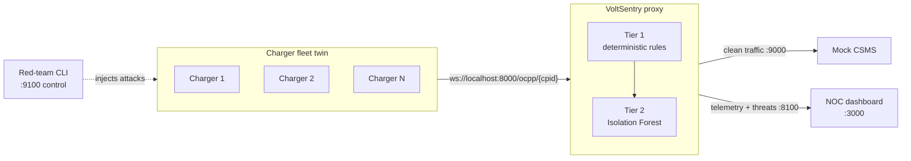

<div align="center">

# ⚡ VoltSentry

**An inline OCPP 1.6-J security proxy that quarantines compromised EV chargers before they reach your backend or your grid.**


*Built for the CodeToCreate hackathon (VIT Vellore).*

</div>

---

## Table of contents

- [Why VoltSentry](#why-voltsentry)
- [Features](#features)
- [How it works](#how-it-works)
- [Quick start](#quick-start)
- [The dashboard](#the-dashboard)
- [Detection engine](#detection-engine)
- [Testing](#testing)
- [Repository layout](#repository-layout)
- [Project docs](#project-docs)

---

## Why VoltSentry

EV charging stations speak OCPP over WebSockets, and most deployments trust whatever a charger sends. A single compromised or spoofed station can forge meter data, hijack sessions, or synchronise start/stop cycles across a fleet, which can destabilise a local transformer.

VoltSentry sits **transparently between the charge points and the Central Management System (CSMS)**. Clean traffic is relayed untouched. Every WebSocket frame is inspected by a two-tier detection engine, and stations that misbehave are cut off before their traffic reaches the backend.

The repo ships the full demo environment as well as the proxy: a simulated charger fleet, a red-team attack CLI, and a live NOC dashboard.

## Features

- **Transparent inline proxy.** No changes needed on chargers or CSMS beyond pointing chargers at the proxy URL.
- **Tier 1: deterministic rules.** Five pure-function rules covering state order, physics, oscillation, session uniqueness, and transaction integrity, at about 9 µs per frame.
- **Tier 2: behavioural ML.** An Isolation Forest scores each charging session and catches subtle meter drift that no rule fires on.
- **Automatic quarantine.** On forged data the proxy drops the frame, marks the station inoperative, and closes its socket.
- **Cyber-physical charger twin.** A simulated fleet with a CC-CV battery model, so telemetry looks like real charging.
- **Red-team CLI.** A terminal UI that launches attacks against the fleet for live demos.
- **Live NOC dashboard.** Station grid, fleet power chart, transformer-load gauge, threat timeline, forensic JSON export, and a 3D globe of real charging hubs.
- **Fully local.** No cloud services and no paid dependencies.

## How it works



Chargers connect to `ws://localhost:8000/ocpp/{cpid}`. The proxy reads the station ID from the URL path and dials the matching upstream CSMS socket.

| Process            | Command                         | Listens                       | Talks to      |
| ------------------ | ------------------------------- | ----------------------------- | ------------- |
| Mock CSMS          | `python -m simulator.csms`      | `:9000`                       | n/a           |
| VoltSentry proxy   | `python -m proxy.main`          | `:8000` ingress, `:8100` feed | CSMS `:9000`  |
| Charger fleet twin | `python -m simulator.twin`      | control `:9100`               | proxy `:8000` |
| Red-team CLI       | `python -m cli.attack`          | n/a                           | twin `:9100`  |
| NOC dashboard      | `npm run dev` (in `dashboard/`) | `:3000`                       | proxy `:8100` |

## Quick start

**Prerequisites:** Python 3.11+ and Node.js 18+ (dashboard only).

### 1. Install

```bash
# Python side (proxy, simulator, CLI)
python -m venv .venv
source .venv/bin/activate          # Windows: .venv\Scripts\activate
pip install -r requirements.txt

# Dashboard (Next.js)
cd dashboard
npm install
cd ..
```

### 2. Run

> [!IMPORTANT]
> **Start order matters: CSMS → proxy → twin.** The proxy dials the upstream CSMS at handshake time, so the CSMS must already be running.

Use one terminal per process:

```bash
# Terminal 1: mock CSMS
python -m simulator.csms          # :9000

# Terminal 2: VoltSentry proxy
python -m proxy.main              # :8000 ingress, :8100 dashboard feed

# Terminal 3: charger fleet twin
python -m simulator.twin          # fleet -> :8000, control :9100

# Terminal 4 (optional): red-team CLI to drive demo attacks
python -m cli.attack

# Terminal 5: dashboard
cd dashboard && npm run dev       # http://localhost:3000
```

Open <http://localhost:3000>, enter the NOC console, then use the red-team CLI to launch an attack and watch VoltSentry respond.

## The dashboard

| Route          | What you get |
| -------------- | ------------ |
| `/`            | Scroll-driven story landing page that walks through the product and ends with a link into the live console. |
| NOC console    | Station grid, live fleet power chart, transformer-load gauge, threat timeline, and one-click forensic JSON export. |
| `/globe`       | Interactive 3D globe of real EV charging hubs from [OpenChargeMap](https://openchargemap.org). Drag to orbit, scroll to zoom, hover a node for its power profile. |

The NOC console has two data modes:

- **Demo Replay Mode** plays a recorded fixture, so it works without any backend running.
- **Live Charger Stream** connects to the proxy feed on `:8100`.

### Optional: OpenChargeMap API key (globe)

The globe works out of the box with a small bundled sample dataset. For the live global network, add a free key:

1. Get a key at <https://openchargemap.org/site/profile/applications>.
2. In `dashboard/`, copy `.env.local.example` to `.env.local` and set:
   ```
   NEXT_PUBLIC_OPENCHARGEMAP_API_KEY=your_key
   ```
3. Restart `npm run dev`.

## Detection engine

### Tier 1: deterministic rules

Implemented in [`proxy/rules.py`](proxy/rules.py) as pure functions evaluated on every frame.

| Rule                | Trips when |
| ------------------- | ---------- |
| `R1_STATE_ORDER`    | `MeterValues` or `StopTransaction` arrives with no live `Authorize → StartTransaction`. |
| `R2_PHYSICS`        | Power exceeds 150 kW, exceeds 60 kW while SoC is above 80% (CV taper), or is negative. |
| `R3_OSCILLATION`    | 6 or more start/stop transitions occur fleet-wide within a 10 s window. |
| `R4_SESSION_UNIQUE` | A second handshake arrives for a station that already has a live socket. |
| `R5_TXN_INTEGRITY`  | A `MeterValues.transactionId` is unknown or owned by another station. |

**Response to forged data (R2, R5):** the proxy drops the frame, sends `ChangeAvailability{Inoperative}` downstream, and closes the socket with code `4001` once the ack arrives.

**Cost:** about **9 µs mean per frame** (median ~8 µs, p99 under 25 µs, measured over 200k frames). There is no upstream round-trip.

### Tier 2: behavioural ML

Implemented in [`proxy/ml_engine.py`](proxy/ml_engine.py). It catches attacks that look valid frame by frame but are wrong over time.

- **Features (5-D per session):** `[power_kw, soc, dp_dt, duration_sec, energy_residual_kwh]`
- **Model:** `IsolationForest(n_estimators=100, contamination=0.02, random_state=42)`, fitted at boot on a 1000-vector synthetic CC-CV baseline.
- **Scoring:** raw `decision_function` output is mapped through the pinned normalisation in `CONTEXT.md` §5.B. The proxy raises a Tier-2 `ThreatEvent` (the yellow ML badge) when `ml_score > 0.65`.
- **Drift signal:** `energy_residual = register − ∫ reported_power·dt` exposes meters that report one thing while accumulating another.
- **Cold start:** the first two samples of a session score `0.0` because `dp_dt` is undefined, so a session start never causes a false positive.

Scoring runs in the live proxy and every `TelemetryEvent` carries its `ml_score`. Verified end-to-end on the running stack: an honest fleet peaks around `0.30`, while the `subtle_drift` attack climbs past `0.65` with no Tier-1 rule firing. The pinned seed makes both results reproducible.

## Testing

```bash
pytest -q
```

Covers the pure-logic layers: detection rules, ML engine, OCPP parsing, and the battery model. Detection logic and battery maths are developed test-first; the transport layer is verified by running the full stack.

## Repository layout

```
proxy/        asyncio relay + detection engine (rules, ml_engine, ocpp, state, pipeline)
simulator/    mock CSMS, cyber-physical charger twin, CC-CV battery model
cli/          red-team attack TUI
dashboard/    Next.js 14 NOC dashboard, story landing page, and globe
shared/       frozen data contract (schemas.py)
tests/        pytest suites
pitch/        hackathon pitch material
plan/         planning documents
```

## Project docs

- [`CONTEXT.md`](CONTEXT.md): the binding spec, including the pinned ML normalisation.
- [`AGENTS.md`](AGENTS.md): shared agent constitution and folder-ownership rules.
- [`PLAN.md`](PLAN.md): build plan.
